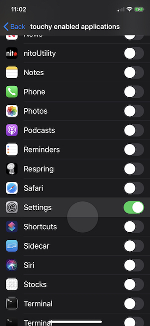

# touchy
Leverage https://github.com/mapbox/Fingertips (showing touches in targeted application) on jailbroken devices through an applist bundle.

Instead of swapping the UIWindow implementation with the MBFingerTipWindow, this adds the necessary extra methods/properties to UIWindow to do the exact same thing MBFingerTipWindow does to display touches.

It it possible to get it to show touches on SpringBoard as well, but currently it must be toggled through plutil until I modify the prefloader bundle to have a special setting to show an option specifically for injection into SpringBoard.

  <br/>
 <br/>
```
plutil -value 1 -type bool -key com.apple.springboard /var/mobile/Library/Preferences/com.nito.touchy.plist
killall -9 SpringBoard
```

Conversely, to turn touches off in SpringBoard the following would be necessary

```
plutil -remove -key com.apple.springboard /var/mobile/Library/Preferences/com.nito.touchy.plist
killall -9 SpringBoard
```
