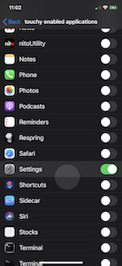

# touchy
Leverage https://github.com/mapbox/Fingertips (showing touches in targeted application) on jailbroken devices through an applist bundle.

Instead of swapping the UIWindow implementation with the MBFingerTipWindow, this adds the necessary extra methods/properties to UIWindow to do the exact same thing MBFingerTipWindow does to display touches.

SpringBoard touches can be toggled from the settings now  as well, no more need to manually toggle with plutil

   
  
  

